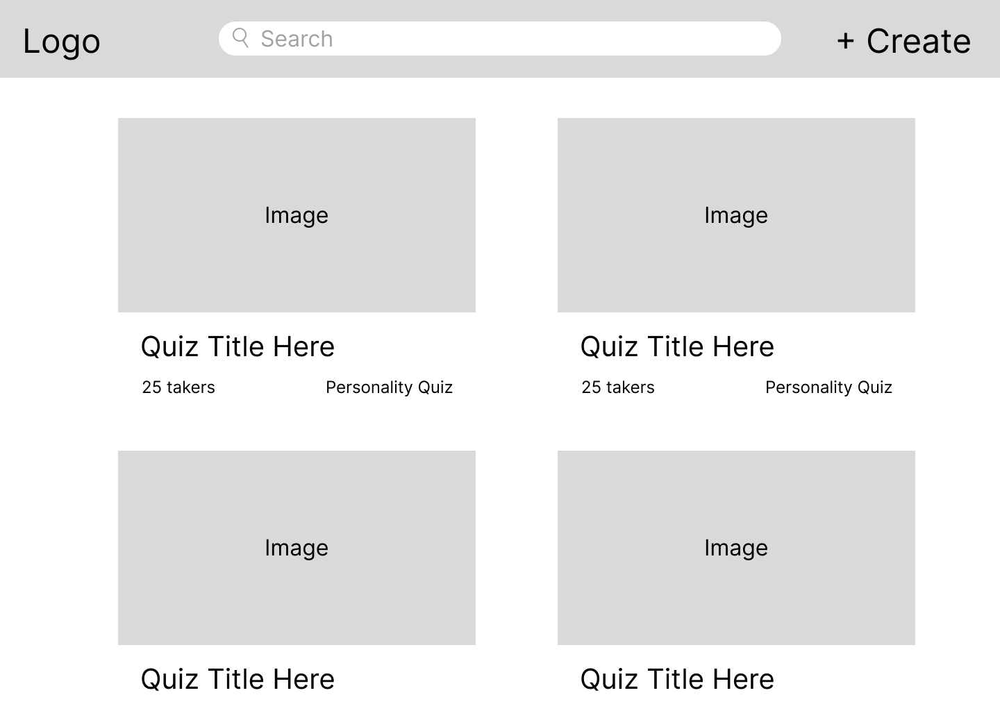
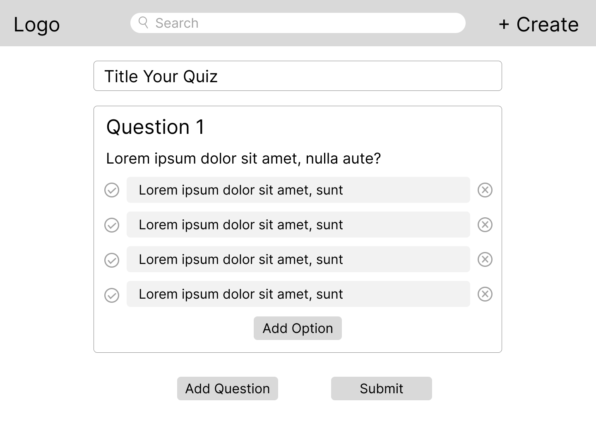
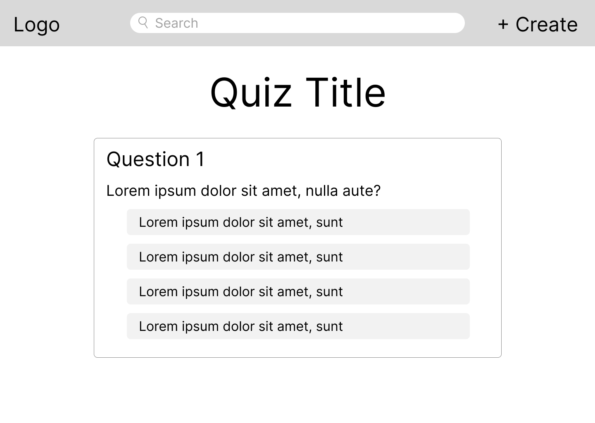
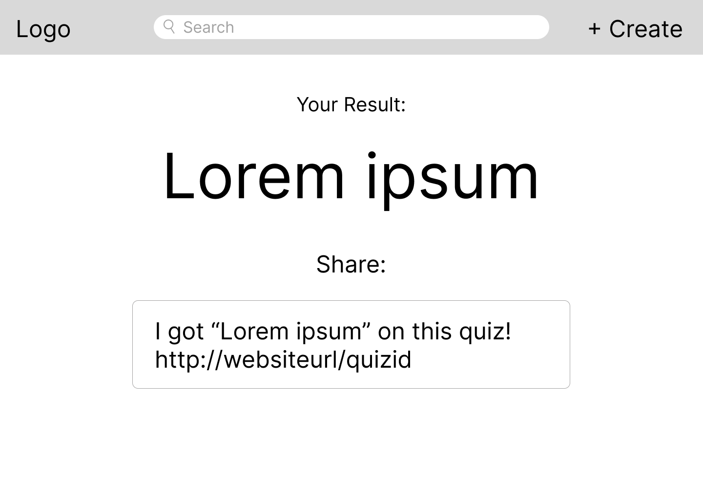

# Wireframes

Reference the Creating an Entity Relationship Diagram final project guide in the course portal for more information about how to complete this deliverable.

## List of Pages

<!-- [👉🏾👉🏾👉🏾 List the pages you expect to have in your app, with a ⭐ next to pages you have wireframed] -->

## Wireframe 1: Home Page ⭐

## Wireframe 2: Quiz Creator ⭐

## Wireframe 3: Quiz Taker ⭐

## Wireframe 4: Results ⭐

